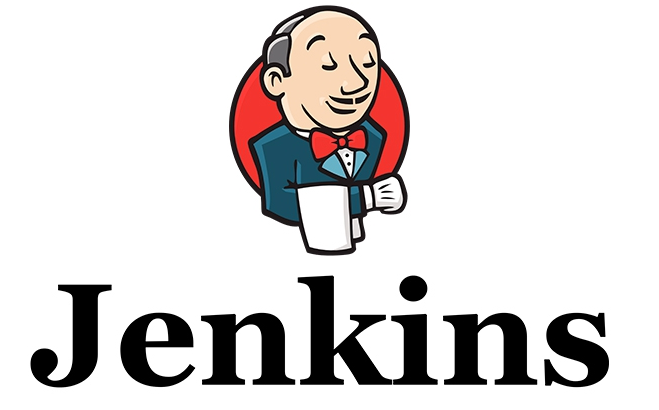

## DISEÑO Y REALIZACIÓN DE PRUEBAS

### ÍNDICE
- Introducción
- Pruebas
- Integridad
- Calidad

### INTRODUCCIÓN

#### Objetivos:
1. Probar si el software no hace lo que debe hacer.
2. Probar si el software hace lo que no debe hacer.

#### Frameworks para la realización de pruebas:
Tiene herramientas comunes y permite unificar el proceso de desarrollo entre desarrolladores.

### PRUEBAS

Hay pruebas dinámicas y estáticas.
Las pruebas **dinámicas** requieren la **ejecución** de la aplicación, mientras que en las **estáticas no**. Las primeras miden el comportamiento de la aplicación y las segundas examinan el código fuente.

#### Estrategias de prueba

##### Caja negra:
Se estudia el sistema **desde fuera**. Son pruebas **funcionales**.

##### Caja blanca:
Se examina el **código fuente** y su ejecución. Son pruebas **estructurales**.

#### Tipos de pruebas

##### Funcionales: Evalúan el cumplimiento de los **requisitos**.
- Pruebas unitarias (o de unidad)
- Pruebas de regresión
- Pruebas de integración
- Pruebas de humo (smoke test)
- Pruebas del sistema
- Pruebas alfa y beta
- Pruebas de aceptación (validación por parte del cliente)

##### No funcionales: Evalúan aspectos adicionales como el **rendimiento** o la **seguridad**.
- Pruebas de usabilidad
- Pruebas de rendimiento
- Pruebas de stress
- Pruebas de seguridad
- Pruebas de compatibilidad
- Pruebas de portabilidad

#### Frameworks para pruebas

- Java: JUnit, TestNG
- C++: CppUnit, Google Test
- PHP: PHPUnit
- Javascript: Mocha

#### Anotaciones de JUnit5

- @BeforeAll: El método es invocado **antes de iniciar todos los tests**. Sólo puede haber un método con esta anotación.
- @AfterAll: El método es invocado **después de finalizar todos los tests**. Sólo puede haber un método con esta anotación.
- @BeforeEach: Se ejecuta **antes de cada test**.
- @AfterEach: Se ejecuta **después de cada test**.
- @Disabled: Los métodos marcados con esta anotación **no serán ejecutados**.
- @Test: Representa un **test** que se debe ejecutar.

### INTEGRACIÓN

#### Formas de integración

- Integración Big bang
- Integración Descendente
- Integración Ascendente
- Integración Continua (CI)

#### Servidores de integración continua

- Jenkins
- Bamboo
- TravisCI
- CircleCI

  

#### Cobertura del código

Es una medida que indica el **porcentaje de código** que ha sido **ejecutado** durante las pruebas.
Hay que intentar que el porcentaje de pruebas ejecutadas sea lo más cercano al 100%.

### CALIDAD

#### Calidad del proceso QA (*Quality Assurance*)

QA es un conjunto de actividades para garantizar la **calidad en los procesos** mediante los cuales se desarrollan los productos.

#### Calidad del producto QC (*Quality Control*)

QC es un conjunto de actividades para garantizar la **calidad de los productos**. Las actividades se centran en identificar defectos en los productos reales producidos.

#### Factores de calidad

El modelo de McCall define 11 factores de calidad.

Operación del producto:
- Corrección
- Fiabilidad
- Eficiencia
- Seguridad
- Facilidad de uso

Revisión del producto
- Mantenibilidad
- Flexibilidad
- Facilidad de prueba

Transición del producto
- Portabilidad
- Reusabilidad
- Interoperatividad
